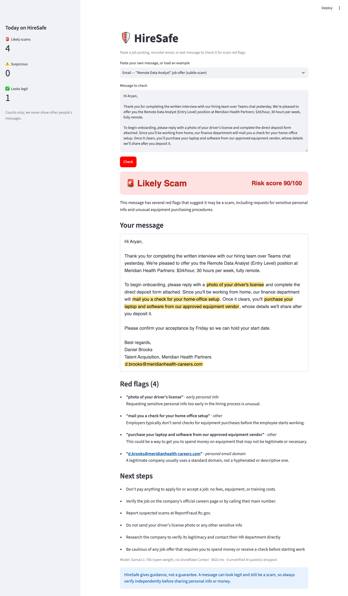

# 🛡️ HireSafe

**Paste a job posting, recruiter email, or text message. HireSafe tells you if it's likely a scam, and shows you exactly why.**

Built in 4 hours at Hacktoberfest Hack Day Tempe × sunhacks (MLH), on an open-weight model (Meta Llama 3.1 70B) running in Snowflake Cortex.

> ⚠️ HireSafe gives guidance, not a guarantee. A message can look legitimate and still be a scam. Always verify independently before sharing personal information or money.

## The problem

Job scams are growing fast. According to the FTC, reports of job and employment agency scams **tripled from 2020 to 2024**, and reported losses rose from **\$90 million to \$501 million** ([FTC, March 2025](https://www.ftc.gov/news-events/news/press-releases/2025/03/new-ftc-data-show-big-jump-reported-losses-fraud-125-billion-2024)). A big driver is "task scams": a friendly WhatsApp or text message offers easy remote work, then asks you to pay in. The FTC received about 20,000 task-scam reports in the first half of 2024 alone, up from roughly zero in 2020 ([FTC Data Spotlight, Dec 2024](https://www.ftc.gov/news-events/data-visualizations/data-spotlight/2024/12/paying-get-paid-gamified-job-scams-drive-record-losses)).

The people targeted are often students and first-time job seekers, who don't yet know what a normal hiring process looks like.

## What HireSafe does

For every message you check, you get:

1. **A verdict**: 🚨 Likely scam, ⚠️ Suspicious, or ✅ Looks legit, plus a 0–100 risk score.
2. **Red flags with exact quotes** from your message, highlighted in place, each with a category and a plain-English explanation.
3. **Similar known scams** from a database of confirmed fraudulent postings.
4. **Next steps**: don't pay anything, verify on the company's official careers page, report at [ReportFraud.ftc.gov](https://reportfraud.ftc.gov).


<!-- TODO: add screenshot -->

## How it works

```
 message
    │
    ├─► 1. Rules ─────────────── fixed checks: fees, crypto/gift cards, WhatsApp/Telegram,
    │                            gmail "recruiters", no-interview hiring, SSN/bank requests, ...
    │
    ├─► 2. Llama 3.1 70B ─────── reads the message, returns strict JSON: verdict, score,
    │      (Snowflake Cortex)    red flags with quotes, summary, advice
    │
    ├─► 3. Quote verification ── every quote the model gives must appear word-for-word in
    │                            the message, or it's dropped before you see it
    │
    ├─► 4. Similarity search ─── e5-base-v2 embeddings + VECTOR_COSINE_SIMILARITY against
    │      (Snowflake)           known scams stored in Snowflake
    │
    └─► 5. Combine ──────────── risk = max(Llama score, rule score, similarity score)
                                → verdict, logged to Snowflake
```

**Scoring** (in [`hiresafe/pipeline.py`](hiresafe/pipeline.py)):

- Rules add 25 points per distinct category matched (capped at 100).
- A close match to a known scam (similarity ≥ 0.92) sets the score to at least 50.
- The final score is the highest of the Llama, rule, and similarity scores, so the rules and similarity can raise the model's score but never lower it.
- ≥ 70 → likely scam, ≥ 35 → suspicious, otherwise looks legit.
- If the model is unavailable, HireSafe still answers using the rules alone.

### Why open-weight models

Both models that make decisions are open-weight: **Meta Llama 3.1 70B** (with 3.1 8B as an automatic fallback) for reading and explaining, and **e5-base-v2** for matching against known scams. Anyone can inspect, reproduce, or self-host the analysis.

Cortex has no built-in tool calling or JSON mode for open-weight models, so HireSafe asks for JSON in the prompt, validates it against a schema, and retries up to twice with the parse error if the output is invalid.

### Keeping the model honest

LLMs sometimes "quote" text that isn't there. HireSafe checks every quote against the original message (ignoring case and whitespace, matching whole words only) and drops any that don't match. The number dropped is shown under every result and measured in the evaluation below.

### What lives in Snowflake

| Object | Purpose |
|---|---|
| Cortex `llama3.1-70b` | The analysis model, called through Cortex's OpenAI-compatible REST API |
| Cortex `EMBED_TEXT_768` (`e5-base-v2`) | Embeddings for similarity search |
| `HIRESAFE.APP.JOB_POSTINGS` | ~18k labeled postings from the EMSCAD dataset |
| `HIRESAFE.APP.KNOWN_SCAMS` | Embedded confirmed scams, searched with `VECTOR_COSINE_SIMILARITY` |
| `HIRESAFE.APP.CHECKS` | A log of every check (verdict, score, flags, model, latency); powers the "Today on HireSafe" tally |
| `HIRESAFE.APP.EVAL_RESULTS` | Every evaluation run, so results are reproducible |

## Evaluation

[`scripts/evaluate.py`](scripts/evaluate.py) runs the full pipeline on 100 postings from the EMSCAD dataset (50 fraudulent, 50 real). The dataset is split in half: the similarity cutoff (0.92) was chosen on one half with [`scripts/similarity_cutoffs.py`](scripts/similarity_cutoffs.py), and these numbers come from the other half. Postings used as known scams are excluded. A posting counts as flagged if the verdict is `suspicious` or `likely_scam`. Same 100 postings, with and without similarity in the risk score:

| Risk score uses | Precision | Recall | F1 |
|---|---|---|---|
| Llama 3.1 70B + rules | 1.00 | 0.12 | 0.21 |
| Llama 3.1 70B + rules + Snowflake similarity search | 1.00 | 0.42 | 0.59 |

No real posting was flagged in either run. Between 0% and 11% of the quotes proposed by the model across our runs did not appear verbatim in the input; HireSafe drops those before showing results.

**Limits:** EMSCAD postings are from 2012–2014 and mostly read like normal job ads. HireSafe is aimed at modern recruiting scams (fees, gift cards, messaging apps, urgency), which this dataset barely contains, so these numbers say little about how it does on the modern messages it's built for. Every run is saved to `HIRESAFE.APP.EVAL_RESULTS`.

## Run it yourself

**Requirements:** Python 3.11+ (we used 3.14) and a Snowflake account with Cortex enabled.

```bash
git clone https://github.com/Mriks42/hiresafe.git
cd hiresafe
python3 -m venv .venv && source .venv/bin/activate
pip install -r requirements.txt
```

Create `.streamlit/secrets.toml` (it's git-ignored; never commit it):

```toml
[snowflake]
account   = "YOUR-ACCOUNT-ID"
host      = "your-account-id.snowflakecomputing.com"
user      = "YOUR_USER"
role      = "YOUR_ROLE"
warehouse = "COMPUTE_WH"
pat       = "your programmatic access token"
# optional: model = "llama3.1-70b", fallback_model = "llama3.1-8b", embed_model = "e5-base-v2"
```

Programmatic access tokens need a network policy that allows your IP, or a temporary bypass granted in Snowsight.

**Just the checker** (only needs Cortex access):

```bash
streamlit run app.py
# or from the command line:
echo "Pay a \$50 registration fee and message me on WhatsApp" | python scripts/check.py
```

**Full setup** (logging, tally, similarity search, evaluation):

```bash
# 1. Run scripts/setup_snowflake.sql in a Snowflake worksheet
# 2. Download the EMSCAD dataset (fake_job_postings.csv, on Kaggle) into data/
python scripts/load_data.py
python scripts/build_embeddings.py
python scripts/evaluate.py      # optional
```

Without the Snowflake tables, HireSafe still works: logging, the tally, and similarity search turn themselves off and log a warning.

## Use it from an AI agent

[`skills/hiresafe-check/SKILL.md`](skills/hiresafe-check/SKILL.md) is an [Agent Skill](https://agentskills.io) that teaches any compatible agent (Claude Code and others) to run HireSafe on a message and explain the result.

## Experimental: investigator agent

[`hiresafe/agent.py`](hiresafe/agent.py) is a prototype in which Llama investigates a message step by step, choosing tools (rule checks, known-scam search, email-domain check) through a small JSON tool-calling loop we wrote, since Cortex has no native tool calling for open-weight models. It isn't part of the app: in our tests it mostly repeated the main check's findings, so it didn't earn a place in the product.

## Project layout

```
app.py                     Streamlit UI
hiresafe/rules.py          fixed red-flag checks
hiresafe/analysis.py       Llama prompt, JSON validation, retries
hiresafe/verify.py         quote verification
hiresafe/pipeline.py       check(): combines everything, scoring
hiresafe/llm.py            Cortex chat client with fallback
hiresafe/similarity.py     similar_scams() via Snowflake vector search
hiresafe/store.py          logging and daily tally
hiresafe/agent.py          experimental investigator agent (not used by the app)
scripts/check.py           CLI: stdin → JSON
scripts/evaluate.py        precision / recall / F1 / unverified-quote rate
scripts/setup_snowflake.sql, load_data.py, build_embeddings.py
skills/hiresafe-check/     Agent Skill
```

## Team

- **Mriganko Chowdhury** ([@Mriks42](https://github.com/Mriks42)): Snowflake, data, LLM client, logging, similarity search, evaluation
- **Aryan Talati**: rules, analysis prompt, quote verification, pipeline, UI, CLI, Agent Skill

## License

[Apache 2.0](LICENSE)
